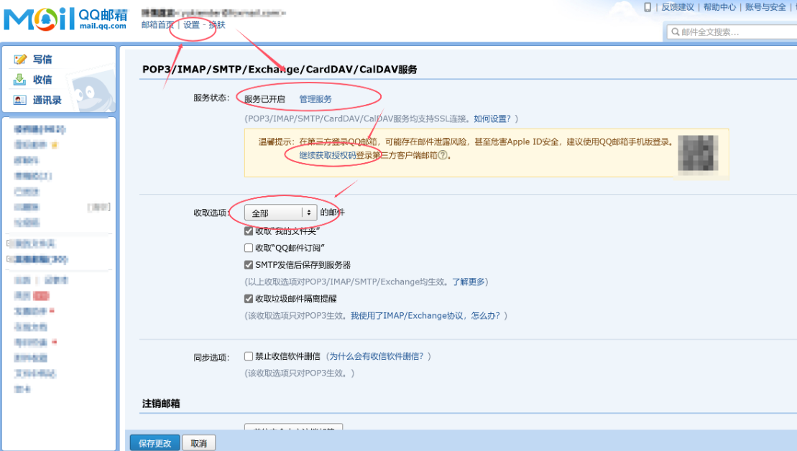
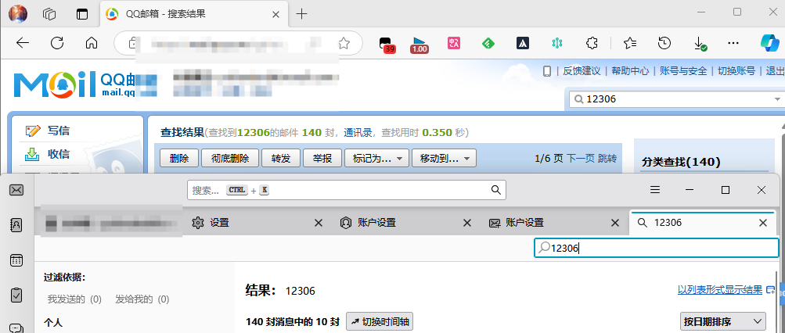
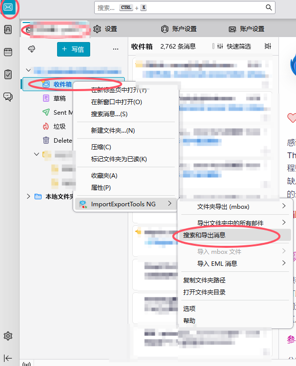
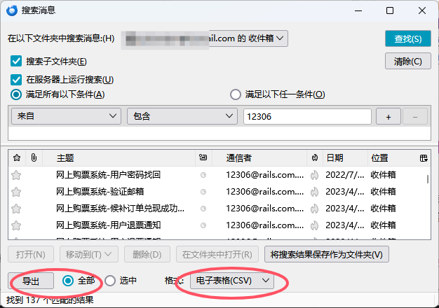

## README
本文件旨在帮助用户通过Thunderbird批量导出12306相关的邮件，并通过相关脚本将信息导入车票票应用程序，解决车票票使用之前车票无法自动同步的问题
以下的操作可以用最方便省事的方法，把买过的所有车票导入到车票票里，解决使用车票票之前的车票无法自动同步，需要一个一个手动添加的问题，以下操作需保证12306里开启了订单发送到邮箱，否则邮箱里无法搜索到相关邮件

### 操作步骤

1. **下载 Thunderbird 软件**  
   从 [Thunderbird 官网](https://www.thunderbird.net/) 下载并安装，用这个邮箱管理软件和相关插件来实现曲线救国批量导出邮件

2. **添加邮箱**  
   这里假定你使用的qq邮箱，在qq邮箱官网，点击左上角设置——账号，在下面根据提示开启POP3/SMTP服务和IMAP/SMTP服务，同时获得授权码备用**（这里的备用码就是一会登录的密码！）**；
  
   
   **同时记住将收取选项选为“全部”，防止无法收取到所有邮件**；

   在 Thunderbird 中，按提示添加QQ 邮箱账号，密码为刚刚的授权码，然后登录，等待右下角进度条同步完所有的邮件，在QQ邮箱和Thunderbird界面搜索'12306'，确保邮件已全部同步
   

3. **下载 ImportExportTools NG 插件**  
   这个插件用于批量导出特定关键词的邮件，在 Thunderbird 中，左下角设置——扩展和主题，搜索下载 ImportExportTools NG 插件

4. **导出邮件**  
   点击收件箱，右键——选择"ImportExportTools NG"——选项——导出目录，设置一个导出目录
   然后右键——选择"ImportExportTools NG"——搜索和导出消息，筛选并导出所有包含关键词 “12306” 的邮件，将这些邮件导出为 CSV 格式文件。
   
   
5. **下载并运行 main.exe**  
下载运行 `main.exe`，程序将自动弹出文件选择窗口， 在文件选择窗口中，选择您导出的 CSV 文件，程序将自动提取邮件内容，并生成一个新的 `.txt` 文件。生成的 `.txt` 文件将保存在与原 CSV 文件相同的目录，文件名为原文件名加上 `_processed.txt` 后缀。 程序运行完成后，生成的 `.txt` 文件会自动打开所在的文件夹。每封邮件内容之间将会以 `###` 分隔。

6. **导入到车票票**  
  将这个txt发送到微信，手机微信打开后右上角——用其他应用打开——拷贝；然后打开车票票——文本提取——粘贴——点击提取，之后可以自己进行手动调整相关车票

