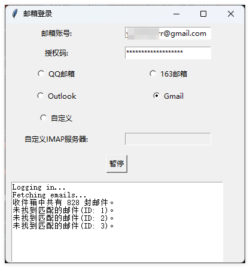
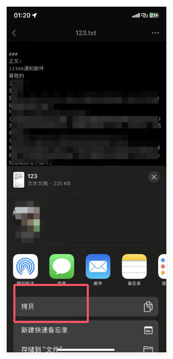
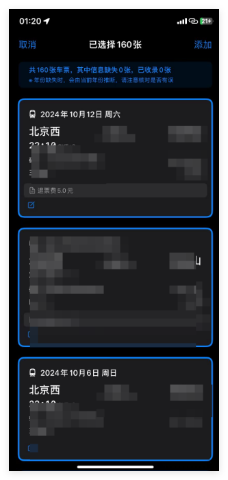

## README
本文件旨在帮助用户通过脚本一键批量导出12306相关的邮件，并将信息导入车票票应用程序，解决车票票使用之前车票无法自动同步的问题
以下的操作可以用最方便省事的方法，把买过的所有车票导入到车票票里，解决使用车票票之前的车票无法自动同步，需要一个一个手动添加的问题，以下操作需保证12306里开启了订单发送到邮箱，否则邮箱里无法搜索到相关邮件

### 操作步骤

1**添加邮箱**  
   这里假定你使用的qq邮箱，在qq邮箱官网，点击左上角设置——账号，在下面根据提示开启POP3/SMTP服务和IMAP/SMTP服务，同时获得授权码备用**（这里的备用码就是一会登录的密码！）**；
  
   
   **同时记住将收取选项选为“全部”，防止无法收取到所有邮件**；

你可能会用到的：
gmail专用密码(开启两步验证后需要的)https://myaccount.google.com/u/6/apppasswords?gar=1
注:outlook因为不想琢磨Oauth2.0，故不支持

2**下载并运行 main.exe**  
下载运行 `main.exe`并打开，输入邮箱地址和授权码，点击开始处理，等待程序运行完毕，导出完毕会弹出保存路径，自己选择路径简单命名即可，运行期间请勿再次点击；

3**导入到车票票**  
将这个txt发送到微信，手机微信打开后右上角——用其他应用打开——拷贝；然后打开车票票——文本提取——粘贴——点击提取，之后可以自己进行手动调整相关车票

注：如果你在使用过程中出现问题，可以使用release中的旧版v0.0.1版本和对应的教程，该版本使用Thunderbird和ImportExportTools NG 插件来辅助邮件导出，脚本仅做邮件内容提取，更加稳定且支持所有邮件账户，但是需要手动操作