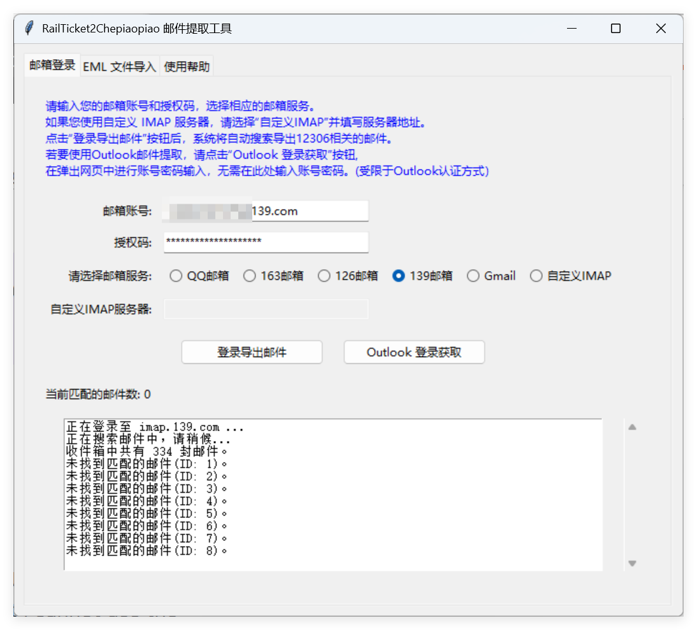

## README
本文件旨在帮助用户通过脚本一键批量导出12306相关的邮件，并将信息导入车票票应用程序，解决车票票使用之前车票无法自动同步的问题
以下的操作可以用最方便省事的方法，把买过的所有车票导入到车票票里，解决使用车票票之前的车票无法自动同步需要一个一个手动添加的问题，以下操作需保证12306里开启了订单发送到邮箱，否则邮箱里无法搜索到相关邮件

### 操作步骤

1**添加邮箱**  
   这里假定你使用的qq邮箱，在qq邮箱官网，点击左上**角设置**——账号，在下面根据提示开启POP3/SMTP服务和IMAP/SMTP服务，同时获得授权码备用 **（这里的备用码就是一会登录的密码！）**；
  
   
   **同时记住将收取选项选为“全部”，防止无法收取到所有邮件**；

你可能会用到的：
gmail专用密码(开启两步验证后需要的)
https://myaccount.google.com/u/6/apppasswords?gar=1

2**下载并运行 RailTicket2Chepiaopiao**  
windows在release中下载运行最新版本的 `RailTicket2Chepiaopiao.exe`并打开;

MacOS在release中下载解压最新版本的 `RailTicket2Chepiaopiao.zip`

打开`RailTicket2Chepiaopiao_macos_universal.app`，如果提示无法打开“RailTicket2Chepiaopiao”，因为Apple无法检查其是否包含恶意软件(当然肯定没有），到系统设置 >隐私与安全性，滑到底部“安全性”部分，点击“已阻止`RailTicket2Chepiaopiao.app`以保护Mac”右侧的“仍要打开“按钮;

或者右键解压后的`RailTicket2Chepiaopiao_macos_universal.app`,点击显示包内容，然后打开终端，输入chmod +x ，然后将`Contents/MacOS/里的RailTicket2Chepiaopiao_macos_universal`拖入终端（**注意+x的前后都有空格）**，回车，然后再打开`RailTicket2Chepiaopiao.app`即可
这里有动图说明，可等待加载

接下来输入邮箱地址和授权码，点击开始处理，等待程序运行完毕，导出完毕会弹出保存路径，自己选择路径简单命名即可；运行期间再次点击则为保存现在已经查询到的邮件（不推荐）；

3**导入到车票票**  
将这个txt发送到微信，手机微信打开后右上角——用其他应用打开——拷贝；然后打开车票票——文本提取——粘贴——点击提取，之后可以自己进行手动调整相关车票

注：如果你在使用过程中出现问题，可以使用release中的旧版v0.0.1版本和对应的教程，该版本使用Thunderbird和ImportExportTools NG 插件来辅助邮件导出，脚本仅做邮件内容格式化，更加稳定且支持所有邮件账户，但是需要手动操作
